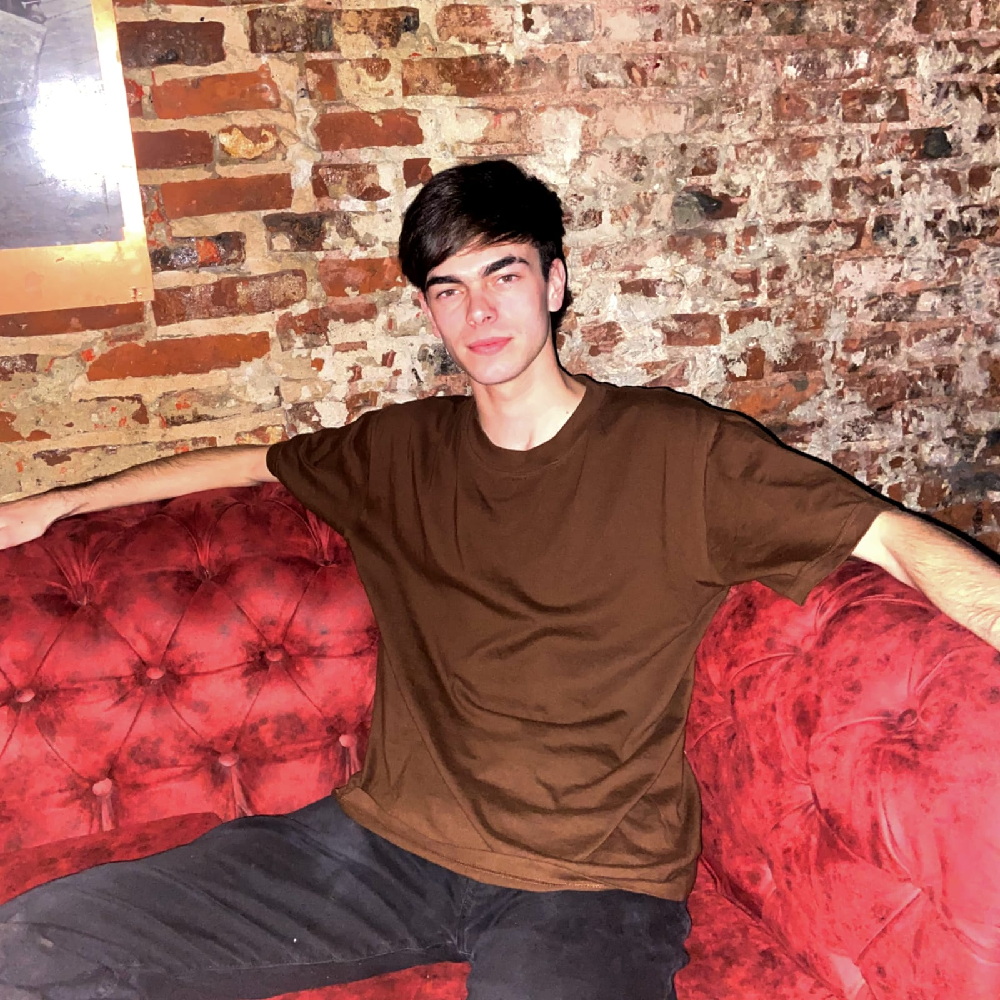

## Leandro Dezuliani

Buenas, mi nombre es Leandro Dezuliani y este es mi cuarto cuatrimestre en la carrera "Tecnicatura en programacion". Soy amante del futbol, la musica y los jueguitos de la compu, y aunque pasen los años, sueño con ser jugador profesional o ser un gran musico (si, soy un soñador).

Siempre fui de interesarme por muchisimas cosas, tanto que no sabia que estudiar o que hacer al terminar el secundario, sin embargo, me di cuenta que la programación (algo de lo que se habia empezado a hablar muchisimo) abarcaba muchas ramas, entre ellas el diseño y desarrollo web.

Desde que tengo memoria siempre me dedicaba a crear contenido, ya sea imagenes o videos con photoshop y sony vegas. Esto me llevo a darme cuenta con el tiempo que me llamaba mucho la atencion crear cosas agradables a la vista, con los colores justos y en un buen orden. Asi, fue como decidi anotarme a la tecnicatura en programacion y aprender por mi cuenta diseño y desarrollo web.

Creo tener buen ojo, y a dia de hoy diseñe varias paginas web que me gustan mucho. Planeo ganarme la vida de esa manera, o quien sabe a donde me lleve la vida, vivir de algo que tenga que ver con el diseño. Ojo, capaz me convierto en jugador profesional o en Gustavo Cerati 2.

Aprovecho hacer publicidad para comentar que tambien dedico mi dia a dia a mi emprendimiento de impresiones 3D (@Drakkar3d_). En el imprimo diseños a pedido de otras personas o hechos por mi mismo. Esto es algo que a lo que no le habia dedicado mi tiempo a investigar, pero cuando lo hice, creo que abrio un nuevo camino en mi vida.

Les dejo una foto mia :)

